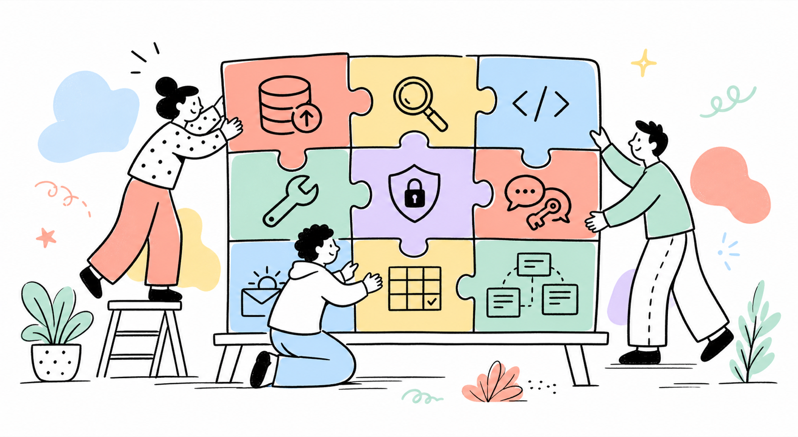

# Jigsaw

ProcessWire operations and developer toolkit maintained by Maxim Semenov.

Jigsaw is one ProcessWire module that combines a set of focused operational,
site, access, and development tools. ProcessWire discovers and installs only
`Jigsaw.module.php`; the donor projects have been refactored into internal
feature controllers and services under `src/Features/`.

## Features

- DB Backup — backups, restore, migrations and schema snapshots
- Diagnostics — page tree, duplicate-title and URL checks
- Editor — template and module file editor
- Admin Bar — frontend administration shortcuts
- Uninstaller — dependency-aware module removal
- Announcement Bar — dismissible frontend announcements
- SSL Manager — certificate monitoring, CSR and certificate tools
- Language Access — language editing permissions
- WarmUp — email warmup coordinator and statistics
- Field Audit — field and Repeater Matrix inventory
- Context — AI-ready site exports, prompts, CLI and AI gateway

Context samples preserve structured FieldtypeCombo, FieldtypeTable, page
reference, and nested values so downstream editorial tooling receives the
actual field data rather than an empty JSON object.

The original repositories are source donors, not runtime dependencies or
submodules. Their imported revisions are recorded in
[`sources.lock.json`](sources.lock.json). Context continues here after its
standalone repository was archived.

## Requirements

- ProcessWire 3.0.200 or newer
- PHP 8.2 or newer

Individual features may have additional optional requirements. For example,
scheduled database backups use LazyCron and cloud backups require cURL.

## Installation

1. Copy the complete `Jigsaw` directory to `site/modules/Jigsaw`.
2. In ProcessWire, open **Modules → Refresh**.
3. Install **Jigsaw**.
4. Open **Setup → Jigsaw**.

No secondary modules are installed. Open **Modules → Configure → Jigsaw** to
enable features and edit all feature settings. Admin tools are available as
sections below **Setup → Jigsaw**.

## Updating

Donor code is internalized deliberately. Review a donor update, adapt it to the
`Jigsaw…Feature` boundary, update `sources.lock.json`, and test the complete
module. Do not copy a donor `.module.php` entry point into Jigsaw.

## lqrs-utils

The Jigsaw dashboard's lightweight inventory and Diagnostics feature
were informed by the useful read-only ideas in `mxmsmnv/lqrs-utils`, especially
`stat.php`, `duplicates.php`, and `digits.php`. The original scripts were not
copied because they are tied to LQRS data, contain destructive operations, and
are not safe as reusable module code.

## Security

Jigsaw is intended for trusted administrators. Assign powerful feature
permissions—especially backup/restore, file editing, SSL, and uninstall
permissions—only to trusted roles.
